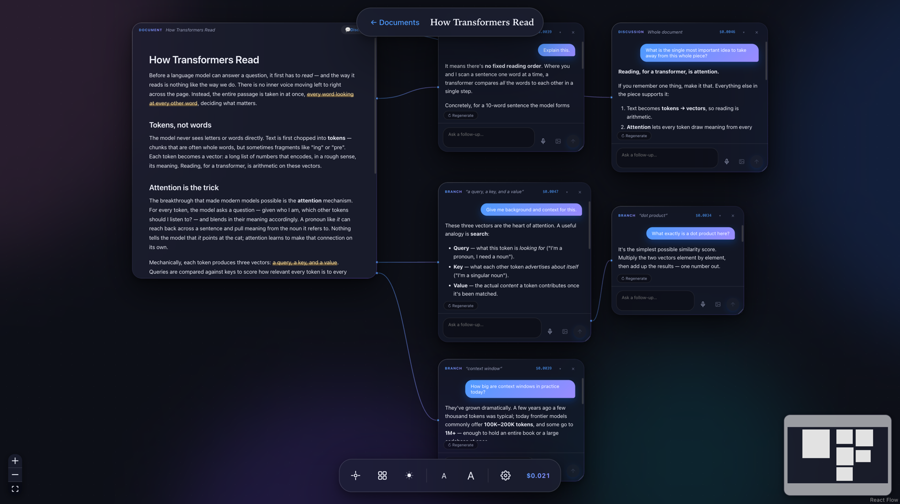
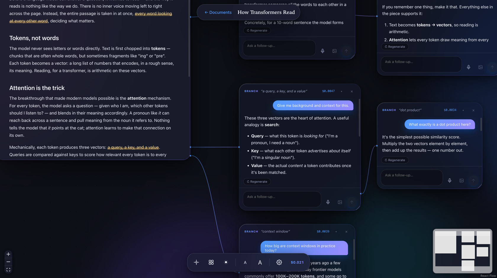
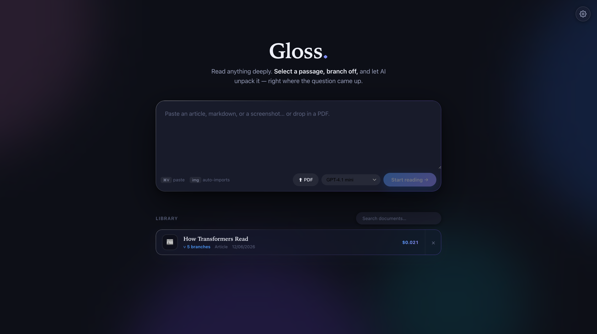

# Gloss

A branching reading experience. Paste long-form text, markdown, or a screenshot;
read it as a document on an infinite canvas; select any word, phrase, or paragraph
and **branch off** an AI conversation anchored to that selection. Branches are full
Claude conversations that know the whole document — and selections inside AI answers
can branch again, recursively.



> Reading a passage, branching off questions where they come up, and chasing a
> follow-up by branching again _inside_ an answer:
>
> 

Paste anything on the home page to start — your library lives below the omnibox:



> The screenshots above are reproducible without an API key:
> `GLOSS_DATA_DIR=/tmp/gloss-showcase node scripts/seed-showcase.mjs`, then
> `GLOSS_DATA_DIR=/tmp/gloss-showcase pnpm dev`.

## Setup

```sh
pnpm install
pnpm dev               # server on :8787, app on http://localhost:5173
```

Add your API keys in-app (**Settings → API keys**, the cog on the home page) —
no `.env` required. Keys are stored locally under the app's data dir and never
leave your machine except to the provider. A `.env` (copy `.env.example`) still
works as a fallback; an in-app key overrides it.

## Desktop app (Electron)

```sh
# Dev: run the web dev servers, then open the Electron window pointing at them
pnpm dev
pnpm electron:dev

# Production-style: build the client + bundle the server, run the self-contained app
pnpm desktop:start

# Package a macOS app + .dmg you can drag into Applications
pnpm desktop:dist     # → desktop/release/Gloss-<version>-arm64.dmg
```

The `.dmg` is **unsigned** (built with `identity: null`), so the first launch
needs a right-click → **Open** to get past Gatekeeper (or
`xattr -dr com.apple.quarantine /Applications/Gloss.app`). The desktop app shares
its data dir with the web app (`~/Library/Application Support/gloss`), so your
documents and saved keys carry over.

The desktop build (`desktop/`) bundles the Hono API server into a single file
(`desktop/dist/server.mjs`), starts it in the Electron main process with the
data dir at the OS per-user app-data location, and serves the built client from
the same origin. Because it's BYOK, the packaged app needs no `.env`.

## How it works

- **Canvas** — the document and every branch conversation are nodes on a pan/zoom
  canvas (React Flow). Edges run from the highlighted span to its branch and track
  the span as the document scrolls.
- **Branching** — select text in the document (or in any AI answer) → a floating
  toolbar offers *Explain*, *More context*, or *Ask…*. Each creates an anchored
  branch node with its own streaming chat.
- **Whole-document chat** — the **💬 Discuss** button in the document header opens
  a discussion about the entire document rather than one passage. It's a branch
  with no anchor, so it shares the same streaming, follow-ups, and nested
  branching as a selection branch.
- **Whole-document awareness** — every branch request carries the full document in
  a prompt-cached system block (`cache_control: ephemeral`), so all branches of a
  document share one cache entry. Cache hits show in the per-reply usage badge.
- **Image import** — paste a screenshot on the home page; Claude vision transcribes
  it to markdown once at import, and branching works identically to text documents.

## Architecture

```
shared/   types + zod schemas + SSE event contracts
server/   Hono API (createApp() is Electron-mountable), Claude streaming, JSON store
client/   Vite + React SPA: canvas, selection→anchor mapping, highlight injection
```

Data persists as JSON under `~/Library/Application Support/gloss` (override with
`GLOSS_DATA_DIR`). The server is structured for a later Electron build: pure
`createApp()` factory, `process.env`-only config, relative `/api` URLs, no native
modules.
